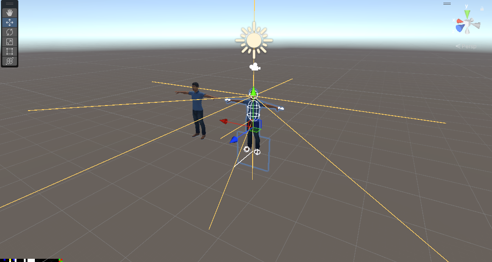

# Avatar Setup Guide

End to end setup for getting ProjectGabriel's sensing layer onto your
avatar. Two pieces: the **Pose HUD** (screen-space coord strip) and the
**Sensor Rig** (VRCRaycast nav rays).

Easy path: open **Tools > ProjectGabriel > Avatar Setup (Installer)**,
drag your avatar in, click install. That's the whole technical part.
The rest of this guide is the manual workflow + the optional VRCFury
bits (local-only toggle, armature link), which the installer does NOT
do for you.

> Unity version tested: **2022.3.22f1** (desktop / flatscreen VRChat).
> VR works too but the strip placement was tuned on flatscreen.

---

## What "done" looks like

When everything is wired up and the `GabrielPoseHUD` GameObject is
enabled, the Unity Scene view should look roughly like this:

- the yellow lines radiating out from the head and hips are the
  VRCRaycast gizmos (front, sides, diagonals, up, down, drop, gaze)
- the colored strip in the bottom-left of the Game view is the pose
  HUD encoding your world position
- nothing else is parented under the Head bone

If your scene matches that picture, the python side will pick up coords
and ray data the moment you upload and put the avatar on.

---

## Step 0 -- one-time install

1. Copy `unity_assets/` from this repo into your VRChat avatar project
   as `Assets/ProjectGabriel/`. Any folder path works, the editor scripts
   write their output under `Assets/ProjectGabriel/Generated/`.
2. Confirm you have the **VRChat Avatar SDK3** in the project (the rig
   builder needs `VRCRaycast` for the sensor rays).
3. **Optional but recommended:** install **VRCFury**. Used for the
   armature link on the sensor rig anchors and for the optional
   local-only toggle on the pose HUD.
4. Wait for Unity to finish compiling. You should see three new menu
   items appear under **Tools > ProjectGabriel**:
   - **Avatar Setup (Installer)** -- one-click installer window
   - Build Pose HUD -- builds just the prefab (manual workflow)
   - Build Sensor Rig -- builds just the prefab (manual workflow)

---

## Step 1 -- run the installer (easy path)

1. Menu: **Tools > ProjectGabriel > Avatar Setup (Installer)**.
2. Drag your avatar from the Hierarchy into the **Avatar** field at the
   top of the window. (Or click **Find avatar in scene** to auto-detect
   the first `VRCAvatarDescriptor` in the open scene.) The window walks
   up parents to find the avatar root automatically, so dragging any
   child of the avatar also works.
3. Tick what you want to install:
   - **Pose HUD** -- the bottom-left coord strip
   - **Sensor Rig** -- the 11 raycast empties grouped under HeadAnchor /
     HipsAnchor
   - **Replace existing instances** -- delete any old `GabrielPoseHUD` /
     `GabrielSensorRig` children before installing the fresh ones.
     Leave checked unless you've hand-edited the existing copies.
4. Click **Install on 'YourAvatar'**.

The window builds the prefabs (or rebuilds if you'd already used the
old menu items), parents fresh instances onto your avatar at identity
transforms, and registers an Undo entry so Ctrl+Z reverts the whole
thing if you don't like it.

After that, jump to **Step 2** for the VRCFury wiring (armature link
on the sensor rig anchors, optional local-only toggle on the pose
HUD). The installer doesn't add VRCFury components because their
internal types shift across releases and reflection-based wiring was
flaky enough that doing two clicks per anchor by hand is faster than
fighting it.

If you'd rather do the install by hand (e.g. for an unusual avatar
hierarchy), skip the installer and follow the manual sections below.

---

## Step 1b (manual) -- Pose HUD

This is the little color strip that encodes your world position. The
python side screen-captures it to know where you are.

### Build the prefab

1. Menu: **Tools > ProjectGabriel > Build Pose HUD**
2. The console prints `[GabrielPoseHudBuilder] built ...`.
3. Unity pings the new prefab in the Project window:
   `Assets/ProjectGabriel/Generated/GabrielPoseHUD.prefab`

### Drop it on your avatar

1. Drag `GabrielPoseHUD.prefab` onto your **avatar root** in the scene
   hierarchy. **Not** under the `Head` bone, **not** under `Hips`,
   **not** under `Armature`. Just the root GameObject that has your
   `VRCAvatarDescriptor` on it.

   > Why: VRChat scales the head bone to zero in first person to hide
   > head-mounted props. Anything parented under Head becomes invisible
   > to yourself. The avatar root stays visible. The vertex shader snaps
   > to NDC corners so the actual prefab transform doesn't matter, only
   > visibility does.

2. Leave its transform at `0, 0, 0` with identity rotation and scale
   `1, 1, 1`.

> The prefab ships with its root GameObject **disabled by default**.
> That's intentional. The VRCFury toggle below (Default On + In Local:
> turn on) wakes it up at world join. If you skip the toggle, just tick
> the GameObject active in the Inspector before upload (or anytime you
> want to use it).

### Optional: local-only toggle with VRCFury

If you want a radial-menu toggle to turn the strip on/off (and to keep
it hidden from other players entirely), add a VRCFury Toggle:

1. Select the `GabrielPoseHUD` GameObject on your avatar (the one you
   just dragged in).
2. Add Component -> **VRC Fury** -> **Toggle**.
3. Set:
   - **Menu Path:** `Toggles/WorldPOSShader` (or whatever you want)
   - **In Local:** Turn On -> drag `GabrielPoseHUD` into the slot
   - **In Remote:** leave empty
   - **Options** (top-right): check **Default On**, **Saved Between
     Worlds**, **Separate Local State**

   `Separate Local State` + empty `In Remote` is the important bit -- it
   makes the strip only render for you, not for other players. The
   python side captures your own screen so this is all it needs.

4. Done, no Full Controller / parameters / animator wiring needed.
   VRCFury bakes the toggle into your menu on upload.

### Upload

Upload the avatar normally. When you wear it the strip will appear in
the **bottom-left corner** of your screen, ~272x16 px, using pure
red/green/blue/black pixels. If you set up the toggle above, find it at
`Expressions -> Toggles -> WorldPOSShader` in the radial menu.

### Customizing position

If something in your HUD covers the bottom-left, you can shift the strip:

1. Select the `GabrielPoseHUD.prefab` asset
2. Find the `MeshRenderer` -> material slot, click it
3. The material exposes:
   - **Cell Size (px per logical pixel)** -- default 8
   - **Offset X (px from left)** -- default 0
   - **Offset Y (px from bottom)** -- default 0
4. Bump `Offset Y` up to ~50 to lift it above the VRChat HUD bar, etc.
5. **Important:** mirror your change in `src/pose_decoder.py`
   (the python side needs to know where to capture from).

### Privacy

With the local-only VRCFury toggle above, the strip is invisible to
other players entirely. If you skipped that and just dropped the prefab
on, anyone whose camera renders your avatar will also see the strip and
could theoretically decode your coords from a screen capture. Either
use the toggle or treat the coords as you'd treat your VRChat instance
ID (not a hard secret, but not something you blast publicly).

---

## Step 2 -- Sensor Rig (raycasts)

> If you ran the installer in Step 1 with **Sensor Rig** ticked, the
> prefab is already on your avatar. Skip to the VRCFury wiring below.

The python side uses VRCRaycast components for forward collision checks,
ledge detection, ceiling height, "what am I looking at", etc.

VRChat caps avatars at 80 raycasts total (shared with FinalIK). The
builder adds 11. Plenty of headroom.

### Build the prefab

1. Menu: **Tools > ProjectGabriel > Build Sensor Rig**
2. Console prints `Built sensor rig: ...`.
3. Two assets get created:
   - `Assets/ProjectGabriel/Generated/GabrielSensorRig.prefab`
   - `Assets/ProjectGabriel/Generated/GabrielSensorParameters.asset`

### Wire it onto your avatar

1. Drag `GabrielSensorRig.prefab` onto your **avatar root**. You'll see
   two children: `HeadAnchor` and `HipsAnchor`, each containing several
   `Ray_*` empties.

2. **Anchor the bones** (two ways, pick one):

   **A) With VRCFury (recommended)**
   - Select the `HeadAnchor` GameObject
   - Add Component -> **VRC Fury** -> **Armature Link**
   - **Link From (Prop / Clothing):** auto-fills with `HeadAnchor`
   - **Link To (Avatar):** pick your **Head** bone from the dropdown
   - Repeat on `HipsAnchor` with **Hips** as the target

   That's it -- no Link Mode, no advanced options. VRCFury merges the
   anchor's children into the target bone on upload.

   *Optional:* with `HeadAnchor` selected you can bump its local Y up a
   little so the head rays originate near the visual center of your
   model's head instead of the bone pivot. Doesn't change OSC output,
   just looks cleaner in the scene gizmos. Personal preference.

   **B) Manual parenting (skip VRCFury entirely)**
   - Drag the `Ray_*` empties out of `HeadAnchor` and into your Head
     bone directly. Same for `Hips`. Then delete the now-empty anchor
     GameObjects.

3. **Animator params:** you do **not** need to add anything to the
   animator. VRCRaycast publishes directly to OSC and does not require
   Expression Parameters or animator wiring -- the values land on
   `/avatar/parameters/<Ray>_Hit` etc. without being declared anywhere.
   The python side reads them straight off the OSC bus.

### Ray names + purposes

| Name        | Bone | Direction               | Length | Purpose                       |
|-------------|------|-------------------------|--------|-------------------------------|
| `Fwd`       | Head | forward                 | 5m     | front collision check         |
| `FwdNear`   | Hips | forward                 | 1.5m   | tight nav obstacle check      |
| `Left`      | Head | -90 yaw                 | 4m     | side clearance                |
| `Right`     | Head | +90 yaw                 | 4m     | side clearance                |
| `LeftFwd`   | Head | -45 yaw                 | 5m     | diagonal samples              |
| `RightFwd`  | Head | +45 yaw                 | 5m     | diagonal samples              |
| `Back`      | Head | 180 yaw                 | 3m     | rear awareness                |
| `DropFwd`   | Hips | forward + down 45 deg   | 3m     | ledge / stair detector        |
| `Down`      | Hips | straight down           | 2m     | floor distance                |
| `Up`        | Head | straight up             | 3m     | ceiling height                |
| `Gaze`      | Head | camera forward          | 30m    | "what is the AI looking at"   |

`Gaze` is configured with `Collision Mode = Hit Both` (worlds + players),
the rest are `Hit Worlds`. The builder sets this for you.

### Upload

Upload the avatar. Make sure **OSC** is enabled on the radial menu when
you wear it (Options -> OSC -> Enabled). Default ports 9000/9001 match
the python config.

---

## Step 3 -- verify it works

1. Run `python main.py` with your AI config pointed at VRChat
2. Wear the avatar in any VRChat world
3. Check the console:
   - `RaycastState` should log auto-discovered ray names like
     `Fwd`, `Left`, etc.
   - `PoseExfilReader` should log a non-zero pose `(x, y, z, yaw)`
4. Open the WebUI Mapping tab -- you should see the occupancy grid fill
   in around your avatar as you walk

If `PoseExfilReader` returns zero pose:
- The strip isn't on screen, or it's covered. Check the bottom-left
  corner. Heavy HUDs or world-side UI can cover it.
- Re-upload after confirming the prefab is on the avatar root, not the
  Head bone.

If the rays are publishing but values look wrong:
- Confirm each ray's empty GameObject has its **forward** axis pointing
  the right way (Unity gizmo, blue arrow). The builder pre-rotates them
  but custom edits can break this.
- Confirm the `Result` child transform exists under each ray. VRChat
  raycasts silently no-op without one. The builder adds them.

---

## What the builders do NOT do

- **VRCFury wiring** -- the Armature Link components and the optional
  Pose HUD toggle are manual. VRCFury's internal types shift across
  releases so reflection-based wiring was too flaky to ship. Two clicks
  each, not a big deal.
- **Avatar uploads** -- you still need to use the VRChat SDK Control
  Panel to build and upload.
- **Animator setup** -- not needed at all. OSC publishes ray data
  directly without going through the animator.
- **PoseHUD privacy** -- if you skipped the VRCFury local-only toggle
  the strip renders to every camera that sees your avatar (other
  players, mirrors). Either add the toggle or treat the coords like
  location data.

---

## Troubleshooting

**"Could not find shader 'ProjectGabriel/PoseExfilScreen'"**
The shader file didn't get imported. Confirm
`Assets/ProjectGabriel/shaders/PoseExfilScreen.shader` exists in the
Project window, then re-run the menu command.

**"VRCRaycast type not found"**
Avatar SDK3 isn't installed or is out of date. Install / update the
VRChat Creator Companion package "VRChat Avatars".

**Strip is at the top-left, not bottom-left**
You're on an older build. Re-import the shader. The fixed version checks
`_ProjectionParams.x` and uses `_ScreenParams.y - vertex.y` on the
desktop forward path.

**Strip flickers / changes color when other players walk by**
Confirm queue is `Overlay+5000` and `Blend Off` is on the SubShader.
Re-import the shader if not.

**OSC isn't publishing the ray params**
VRCRaycast publishes directly to OSC without needing animator or
Expression Parameter entries, so check the basics: avatar is uploaded
with the rig as a child of the avatar root, OSC is enabled in the
radial menu (Options -> OSC -> Enabled), and the `Result` child
transform exists under each `Ray_*` empty (the builder adds these but a
stray manual delete can remove them). VRCRaycast silently no-ops
without `Result`.
